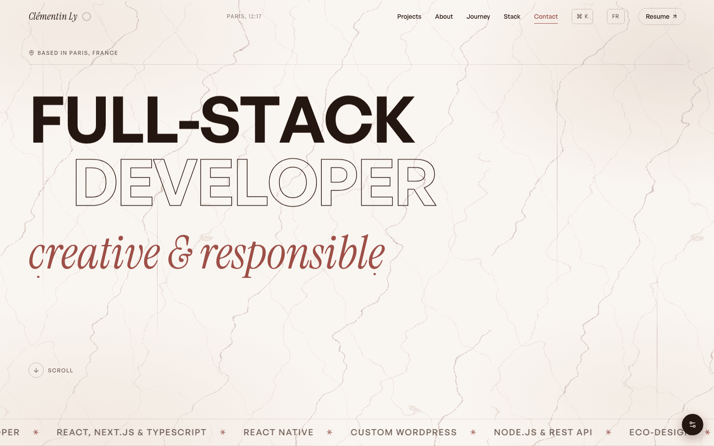
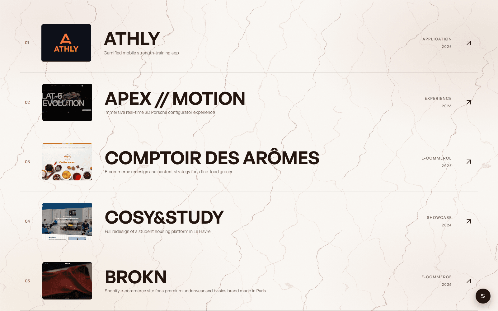
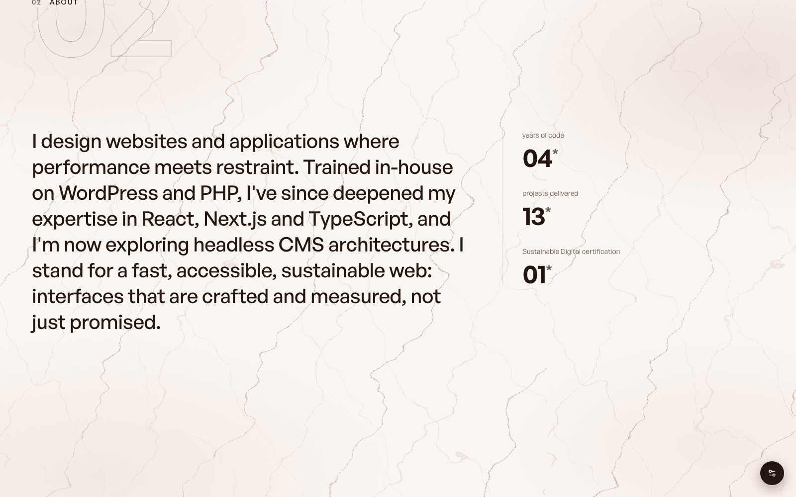
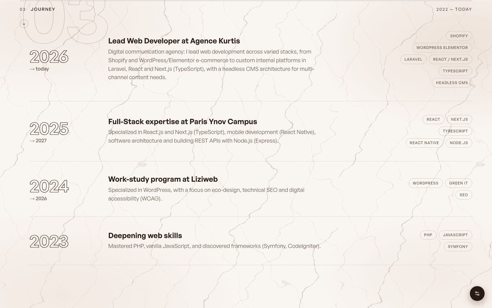
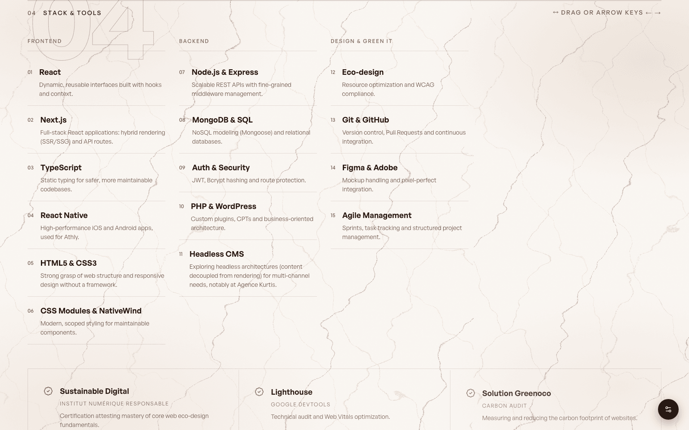
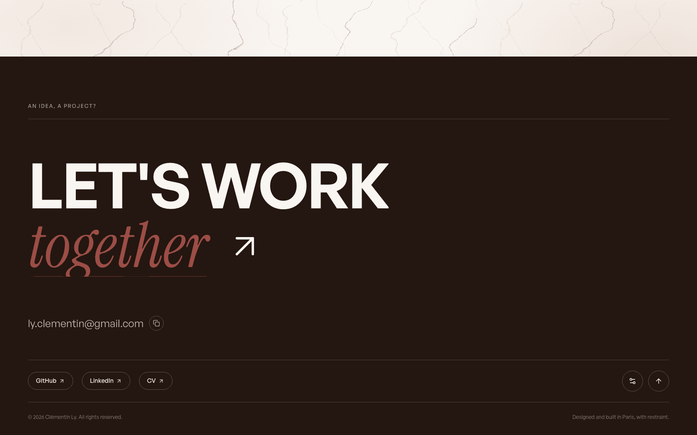
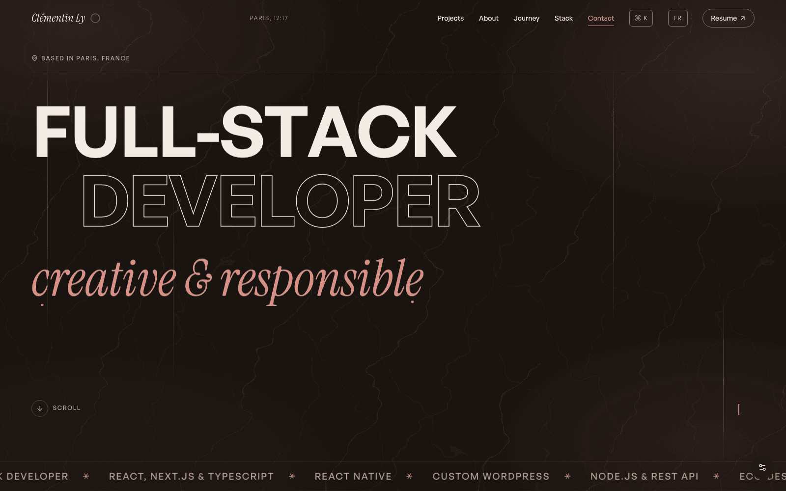
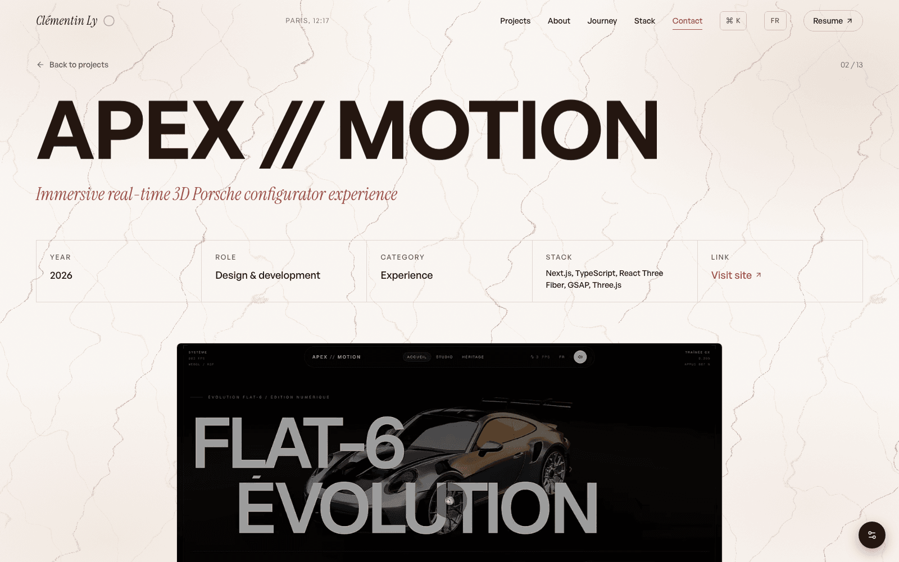

# Clémentin Ly - Portfolio

[](https://github.com/ClemLy/Portfolio-2026/actions/workflows/ci.yml)
[](https://react.dev/)
[](https://www.framer.com/motion/)
[](https://vercel.com/)
[](LICENSE)

Portfolio personnel de **Clémentin Ly**, développeur full-stack basé à Paris. Il présente mon parcours, mes projets et ma stack technique à travers une expérience éditoriale animée au scroll : typographie massive, matière papier/encre, et micro-interactions pensées pour rester sobres et accessibles plutôt que démonstratives.

**Site en ligne : [clementin-portfolio.vercel.app](https://clementin-portfolio.vercel.app)**

## Aperçu

| Accueil | Liste de projets |
| :---: | :---: |
|  |  |

| À propos | Parcours |
| :---: | :---: |
|  |  |

| Stack technique | Contact |
| :---: | :---: |
|  |  |

| Thème sombre | Étude de cas projet |
| :---: | :---: |
|  |  |

## Points clés

* **Design éditorial** : fond papier, encre profonde, accent terracotta, typographie General Sans / Instrument Serif. Thème clair et sombre, persistés et accessibles.
* **Motion au service du contenu** : reveals mot à mot, moment de scroll épinglé dans "À propos", distorsion WebGL au survol des projets, transitions de page en rideau d'encre — chaque interaction reste désactivable via `prefers-reduced-motion` ou le panneau de préférences.
* **Fiche projet détaillée** : contexte, problématique, solution et résultats pour chaque réalisation, avec navigation clavier entre les projets.
* **i18n** : contenu bilingue français / anglais.
* **Accessibilité (RGAA / WCAG AA)** : navigation clavier complète, focus visibles, contrastes vérifiés, respect du mouvement réduit, structure sémantique.
* **Éco-conception** : images responsives (AVIF/WebP multi-résolutions), polices auto-hébergées, code-splitting des expériences 3D, budget de performance suivi via Lighthouse.

## Stack technique

* **Frontend** : React 19, React Router 7, Vite 7.
* **Style** : CSS Modules + design tokens (custom properties CSS).
* **Animations** : Framer Motion (springs, layout animations, scroll-linked), Lenis pour le smooth scroll.
* **3D** : Three.js (chargé à la demande, uniquement sur les visuels qui en ont besoin).
* **Icônes** : Lucide React. **SEO** : React Helmet Async, sitemap généré automatiquement, JSON-LD.

## Installation

```bash
git clone https://github.com/ClemLy/Portfolio-2026.git
cd Portfolio-2026
npm ci
npm run dev
```

Scripts disponibles :

| Commande          | Rôle                                  |
| ----------------- | ------------------------------------- |
| `npm run dev`     | Serveur de développement Vite         |
| `npm run lint`    | Analyse ESLint                        |
| `npm run build`   | Build de production dans `dist/`      |
| `npm run preview` | Prévisualisation du build             |

## Workflow Git & CI/CD

Le dépôt suit un flow simple à deux niveaux :

1. `main` : production, déployée automatiquement par Vercel.
2. `develop` : intégration continue des fonctionnalités.
3. Une branche par changement (`feat/...`, `fix/...`, `design/...`), fusionnée dans `develop` via Pull Request.

À chaque push ou PR vers `develop` et `main`, la CI GitHub Actions (`.github/workflows/ci.yml`) exécute :

* **Lint** : ESLint sur tout le projet.
* **Build** : build de production Vite, rapport du poids du bundle et archivage de `dist/` en artefact (7 jours).

Les deux jobs tournent en parallèle et les runs obsolètes sont annulés automatiquement à chaque nouveau commit. Le déploiement reste géré par l'intégration Vercel (previews sur PR, production sur `main`).

## Performance & accessibilité

* Scores Lighthouse visés : 100 / 95+ / 100 / 100.
* Polices WOFF2 auto-hébergées et préchargées, cache immutable (`vercel.json`).
* Images AVIF/WebP multi-résolutions générées automatiquement, lazy-loading, animations GPU (transform/opacity uniquement).
* Respect systématique de `prefers-reduced-motion`, navigation clavier complète et focus visibles sur l'ensemble du site.

## Licence

Tous droits réservés. Ce dépôt est public à titre de démonstration (code, portfolio, revue technique) - voir [LICENSE](LICENSE) pour le détail.

---

**Clémentin Ly** - Développeur full-stack
[GitHub](https://github.com/ClemLy) · [LinkedIn](https://linkedin.com/in/clémentin-ly/)